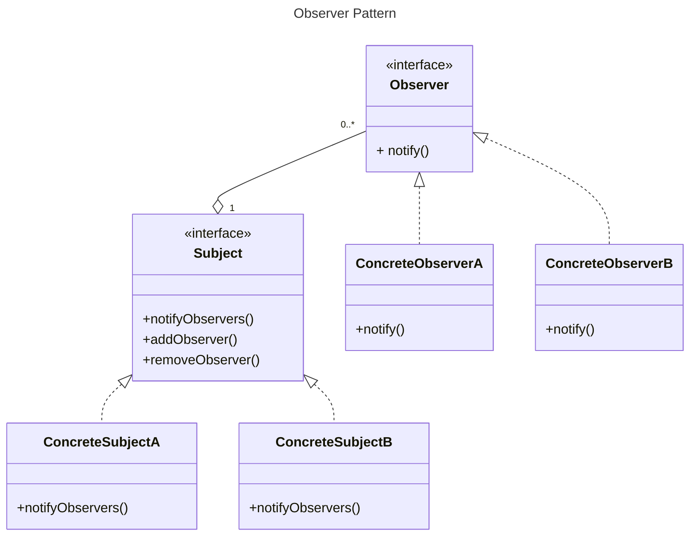
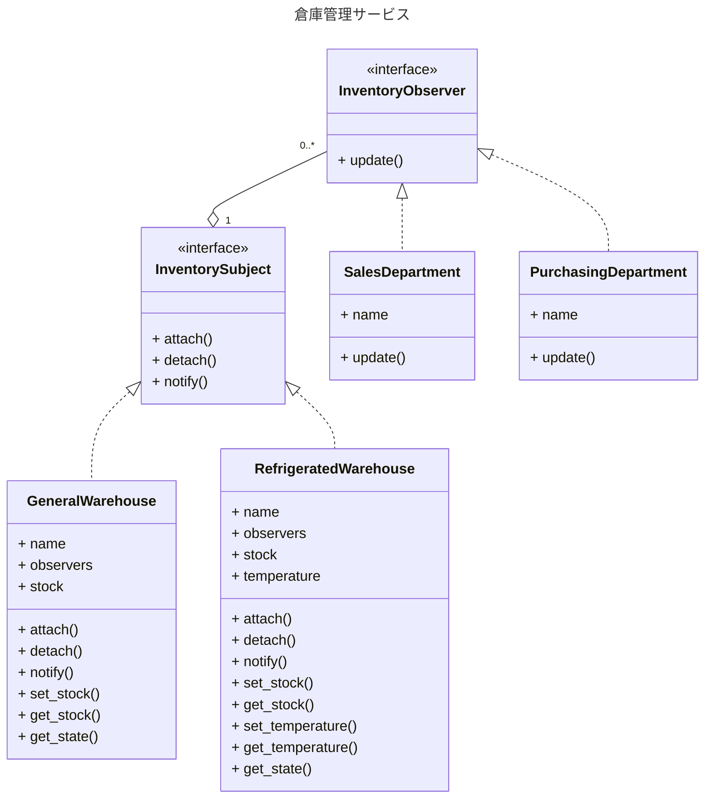

# Observer パターン

オブジェクトの状態を監視して、状態が変化した際に通知を行うパターン
オブジェクト間の一対多の依存関係を定義し、あるオブジェクトの状態が変化した際に、それに依存する全てのオブジェクトに自動的に通知し更新する方法を提供するデザインパターン



## より具体的な例

### シナリオ
オンラインショッピングプラットフォームにおける商品在庫管理システムを想定する。
このシステムでは、複数の倉庫（Subjects）が存在し、各倉庫の在庫状況を様々な部門（Observers）が監視する必要がある。

### 方針
1. Subject インターフェース: 全ての倉庫が実装すべきメソッドを定義する。
2. 具体的な Subject クラス: 異なるタイプの倉庫（例：一般倉庫、冷蔵倉庫）を実装する。
3. Observer インターフェース: 在庫変更通知を受け取るメソッドを定義する。
4. 具体的な Observer クラス: 異なる部門（例：販売部門、購買部門）を実装する。

### 設計


Python で実行
```bash
❯ docker run -it --rm -v $(pwd):/app python-runner pattern/GoF/behavioral/observer/python/observer.py
販売部門 - 在庫更新通知: 一般倉庫Aの在庫: {'商品A': 100}
販売部門 - 在庫更新通知: 一般倉庫Aの在庫: {'商品A': 100, '商品B': 5}
購買部門 - 発注通知: 一般倉庫Aの商品Bの在庫が少なくなっています。
販売部門 - 在庫更新通知: 冷蔵倉庫Bの在庫: {'商品C': 50}
販売部門 - 在庫更新通知: 冷蔵倉庫Bの在庫: {'商品C': 50}
販売部門 - 在庫更新通知: 一般倉庫Aの在庫: {'商品A': 80, '商品B': 5}
```

`observer_pythonic.py` はより Python ジェネリックな機能を活かして Observer pattern を実装したものです。
