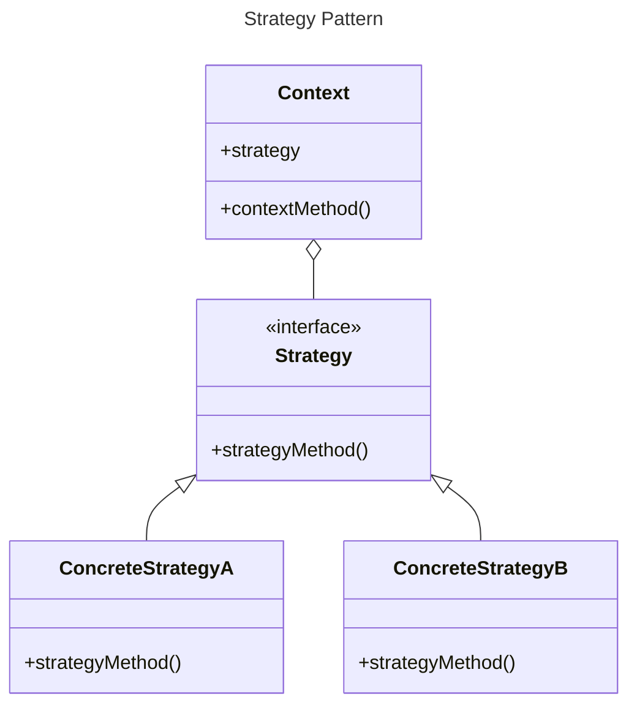
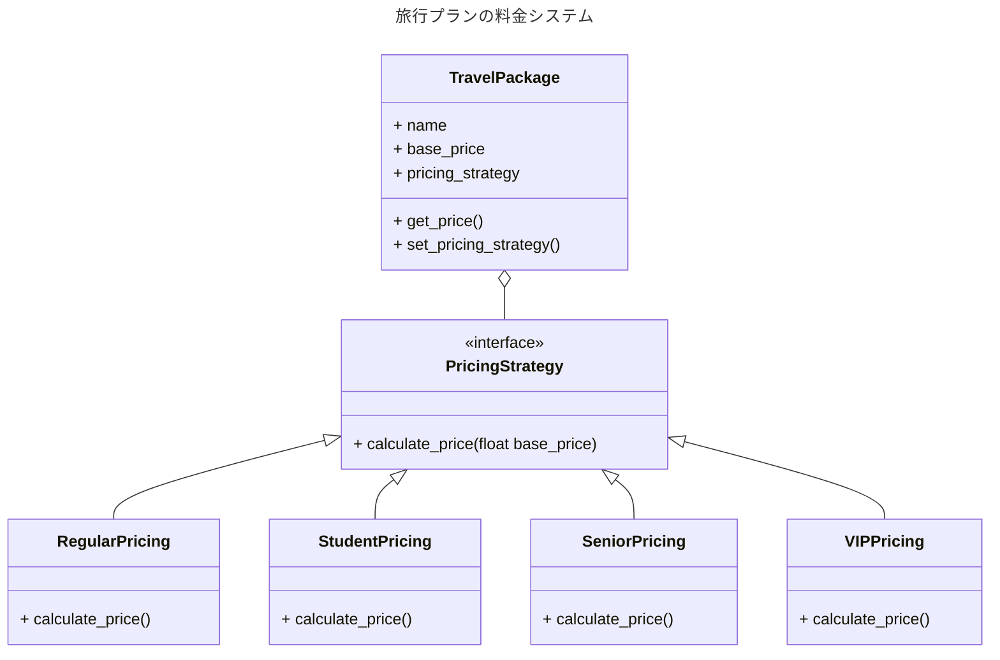

# Strategy パターン

戦略部分をクラス単位で切り離すことで、アルゴリズムを動的に変更できるようにするデザインパターン



## より具体的な例
旅行プランの料金システムを考える。
旅行会社が異なる種類の顧客（一般客、学生、シニア、VIP会員）に対して、異なる料金計算方法を適用したい。料金計算には基本料金があり、顧客タイプによって割引やサービスが適用さる。

これを、以下の方針で Strategy Pattern を利用して実装する。

1. 料金計算のアルゴリズムを Strategy として定義
2. 各顧客タイプに対応する具体的な Strategy を実装
3. Context として旅行プランクラスを作成し、適切な Strategy を使用して料金を計算

このように Stragegy pattern を使って実装することで、仮に新しい計算方法を追加したくなっても、PricingStrategy を実装する Strategy クラスを追加すれば、Context class に変更を加えることなく機能追加ができる。



Python で実行
```bash
❯ docker run -it --rm -v $(pwd):/app python-runner pattern/GoF/behavioral/strategy/strategy.py
Regular price: 1000
Student price: 800.0
Senior price: 700.0
VIP price: 1200.0
```

Go で実行
```bash
❯ docker run -it --rm -v $(pwd):/app go-runner pattern/GoF/behavioral/strategy/strategy.go
Regular price: 1000
Student price: 800
Senior price: 700
VIP price: 1200
```

Rust で実行
```bash
❯ docker run -it --rm -v $(pwd):/app rust-runner pattern/GoF/behavioral/strategy/strategy.rs
Package: Tokyo Adventure
Regular price: $1000.00
Student price: $800.00
Senior price: $700.00
VIP price: $1200.00
```

このような動的なディスパッチはRustの設計哲学的には可能であれば避けるべきで、ジェネリクス (`strategy_generics.rs`) や Enum (`strategy_enum.rs`) を使った静的なアプローチに置き換えを検討する。
